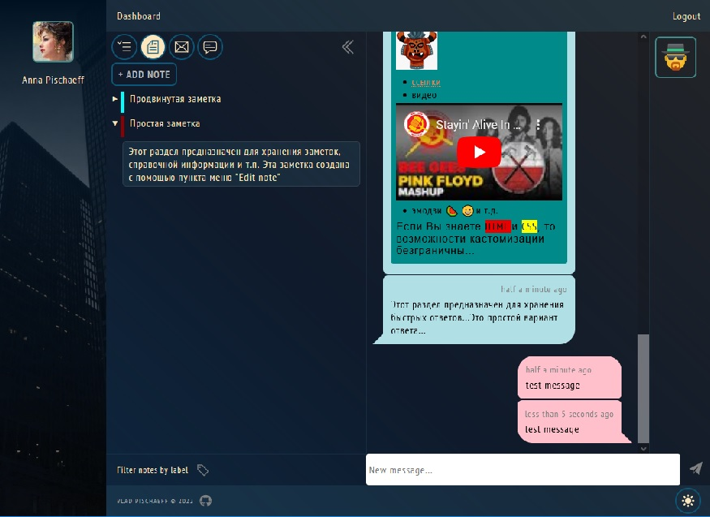

# Websites online helper based on redux-toolkit, rtk-query, react-hook-form, with automatic renewal jwt, Service Worker with WebSocket supply on client side.

## To run dev

- before starting the program, make sure that you have installed lerna
```sh
npm i -g lerna@6.5.1
```
- в каталоге программы выполните команды
```sh
npm run install
```
- создайте файл `.env` в корне проекта
```
ACCESS_JWT_SECRET='jwtAccessSecretKey'
ACCESS_JWT_LIFETIME='5m'
REFRESH_JWT_SECRET='jwtRefreshSecretKey'
REFRESH_JWT_LIFETIME='10d'
MDB_SERVER='localhost'
MDB_DATABASE='database'
SMTP_HOST="smtp.gmail.com"
SMTP_PORT="587"
SMTP_USER="YourMail@gmail.com"
SMTP_PASS="YourPassKey"
REACT_APP_SERVER_ADDR='localhost'
REACT_APP_SERVER_PORT='5000'
REACT_APP_SERVER_PROTO='http'
```
> где:  `MDB_SERVER` - адрес сервера MongoDB, `MDB_DATABASE` - имя базы данных на этом сервере

- запустите все в режиме разработки
```sh
npm run dev
```
- подключитесь к [панели управления](http://localhost:3000)

## To run prod

- populate `.env` with Your values

- в каталоге программы выполните команды
```sh
npm run build-webadmin
npm run build-webpanel
npm run build-tebutton
```

- install `pm2`
```sh
npm install pm2@latest -g
```

- launch server
```sh
pm2 --name tebox --log tebox.log start npm -- start
```

- подключитесь к `http://YourServerName:5001`

- Sign Up

- add `YourControlledWebsiteName.com` into Your profile

- copy `KEY` of `YourControlledWebsiteName.com`

- add `tebutton` web-component to Your controlled website
```html
<!DOCTYPE html>
<html>
    <head>
        ...
        <script type="module" src="http://YourServerName:5001/dist/tebutton.esm.js"></script>
    </head>
    <body>
        ...
        <te-button
            url="http://YourServerName:5001/client"
            host_key="KEY of YourControlledWebsiteName">
        </te-button>
    </body>
</html>
```

### Tebox administration screen




